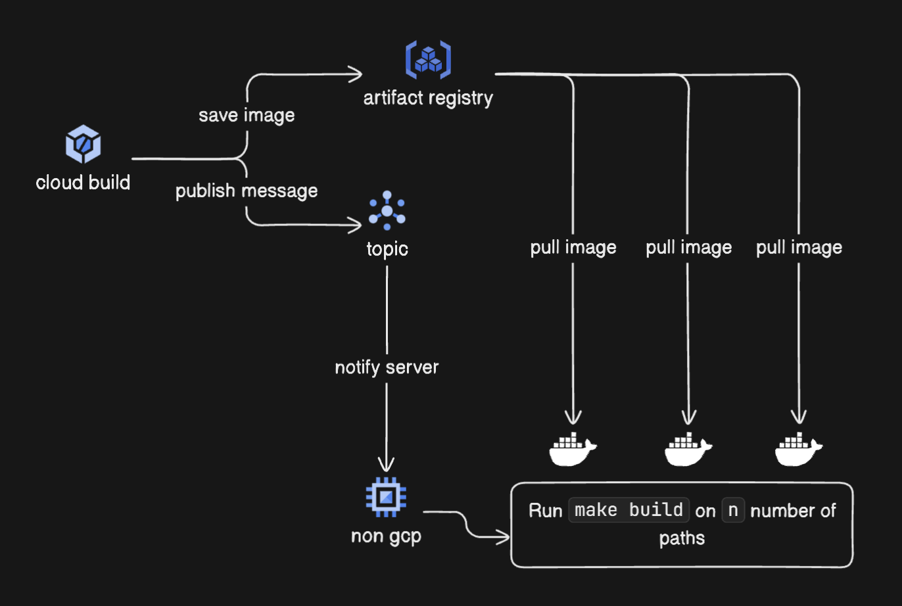

# Code Deployer

## Overview

Code Deployer is a tool designed to automate the deployment of code to a non-gcp environement. It simplifies the process of deploying applications.

## Features

- Automated deployment using pubsub and make

## Design



## Prerequisites 

1. pubsub setup in gcp
2. service account with permission:
	- pubsub
	- artifact registry reader

## Installation

To install Code Deployer, clone the repository and build the project:

```sh
git clone https://github.com/jtefteller/code_deployer.git
cd code_deployer
make install
```

## Usage

To deploy your code, run the following command:

```sh
go build
./code_deployer
```

## Configuration

Configuration files are located in the `config` directory. Modify these files to suit your environment needs.

## Contributing

We welcome contributions! Please fork the repository and submit pull requests.

## License

This project is licensed under the MIT License. See the `LICENSE` file for details.
